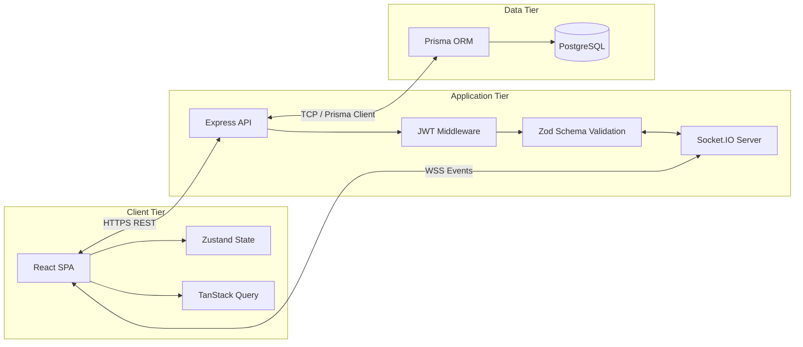
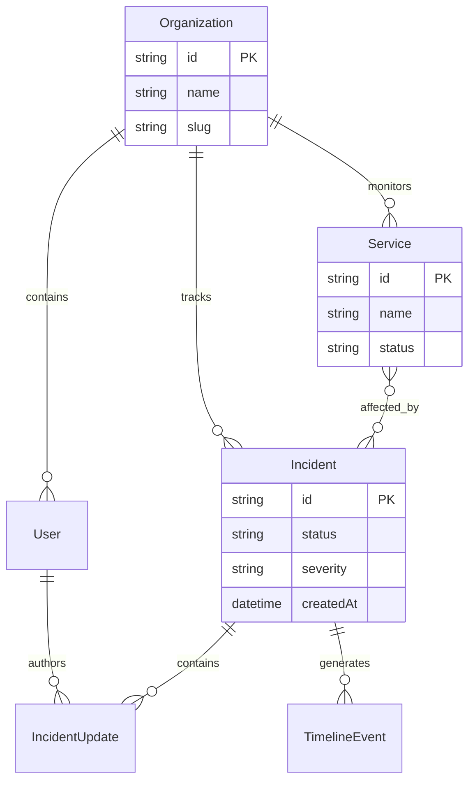
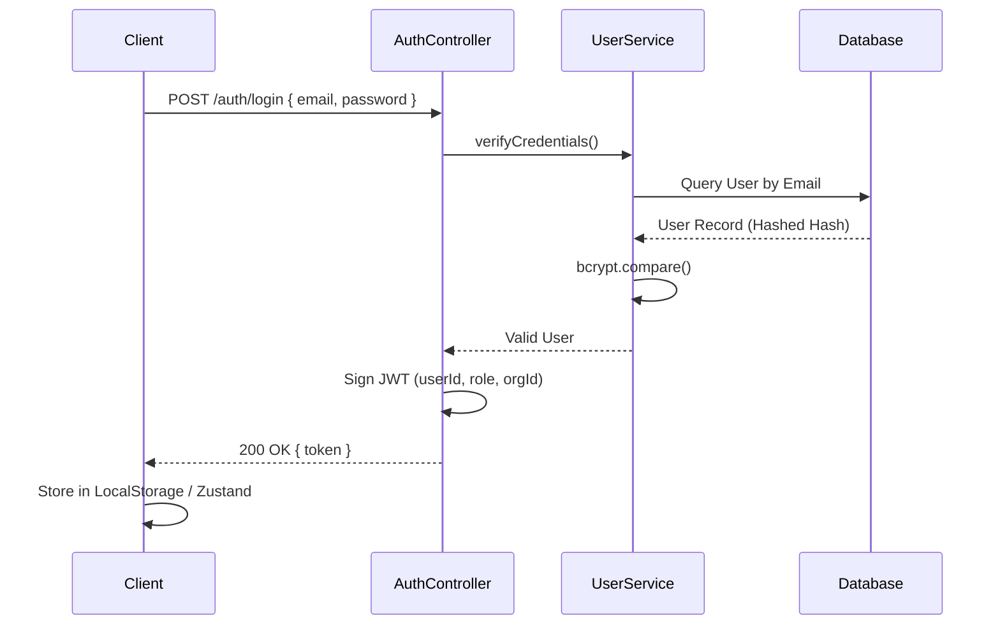
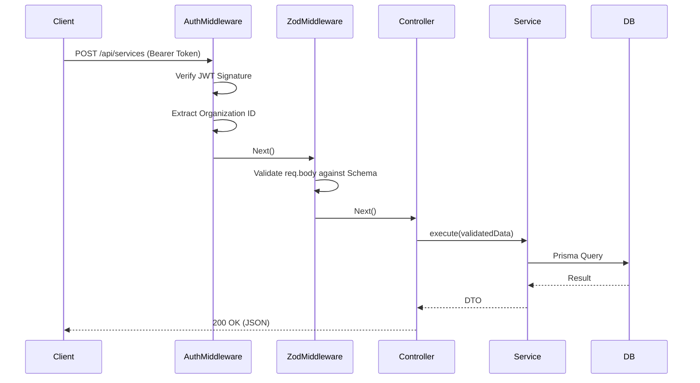
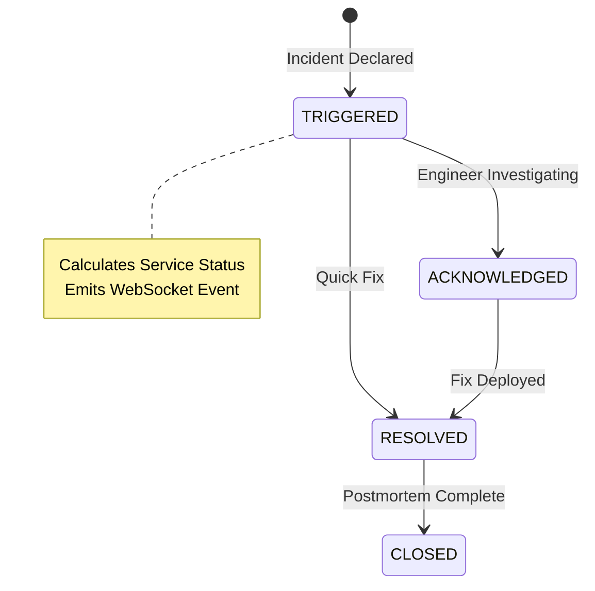

# BlackWater Architecture

This document provides a comprehensive technical deep-dive into the architectural decisions, design patterns, and systemic workflows of the BlackWater platform.

## 1. Executive Summary

BlackWater is a highly responsive, real-time incident management platform built on a modernized Node.js and React stack. Its primary architectural directive is to bridge internal engineering workflows with unauthenticated public status reporting securely, deterministically, and with zero latency. It achieves this by abandoning traditional CRUD patterns in favor of a strictly enforced State Machine and event-driven WebSocket reconciliation.

## 2. System Goals

*   **Deterministic Health**: Eliminate human error by calculating service health algorithmically based on active incident severity.
*   **Absolute Data Isolation**: Guarantee that internal engineering discussions and system identifiers never leak to public endpoints.
*   **Real-Time Synchronization**: Ensure public status dashboards update instantly without relying on inefficient client-side HTTP polling.
*   **Type Safety**: Maintain an unbroken chain of TypeScript definitions from the PostgreSQL database schema directly to the React frontend components.

## 3. High-Level Architecture

The system follows a decoupled, three-tier architecture utilizing RESTful APIs for mutations and WebSockets for state reconciliation.

## 4. Frontend Architecture

The frontend is a Single Page Application (SPA) built with **React 18** and **Vite**.

*   **State Management Strategy**: 
    *   **Server State**: Managed exclusively by **TanStack React Query**. It handles all asynchronous operations, caching, background refetching, and deduping.
    *   **Client State**: Managed by **Zustand**. It handles synchronous, globally required state such as the current authenticated user's JWT payload and active UI themes.
*   **Routing**: Handled by `react-router-dom` with strict protected route wrappers evaluating the Zustand auth state.
*   **Styling**: **Tailwind CSS** combined with `clsx` and `tailwind-merge` for scalable, collision-free utility classes. Component design follows Radix UI accessibility patterns.

## 5. Backend Architecture

The backend is an **Express.js** application written in strict **TypeScript**. It utilizes a modular, feature-based directory structure (e.g., `src/modules/incidents`, `src/modules/services`).

*   **Controller-Service Pattern**: Controllers strictly handle HTTP request extraction and HTTP response formatting. All business logic, state machine evaluation, and database interactions are delegated to dedicated Service classes.
*   **Real-Time Engine**: A globally injected `SocketEmitter` singleton wraps **Socket.IO**. Services call this singleton after successful database commits to broadcast state changes.

## 6. Database Architecture

The persistence layer utilizes **PostgreSQL**, managed by the **Prisma ORM**.

### Key Entities
*   **Organization**: Top-level tenant container. All major queries are scoped by `organizationId` to ensure multi-tenant data isolation.
*   **Incident**: The core aggregate root. Operates purely as a state machine.
*   **TimelineEvent**: An append-only audit log. Uses PostgreSQL `JSONB` to store unstructured snapshots of state transitions.

## 7. Authentication Flow

Authentication is completely stateless, utilizing JSON Web Tokens (JWT) signed with bcrypt hashing.

## 8. Request Lifecycle

Every authenticated API request passes through a strict gauntlet of middleware before reaching business logic.

## 9. Incident Management Flow

Incidents are not simple CRUD objects; they are governed by a strict State Machine. 

The `ServiceHealthEngine` listens to these transitions. If an incident moves to `RESOLVED`, the engine recalculates the health of all attached services. If no other `CRITICAL` or `HIGH` incidents are active for that service, it automatically heals the service back to `OPERATIONAL`.

## 10. Status Page Flow

The Public Status Page (`/status/:orgId`) is designed for maximum resilience.
1.  **Unauthenticated Access**: It hits dedicated public endpoints that do not require JWTs.
2.  **Air-Gapped DTOs**: The backend database queries explicitly filter `where: { isPublic: true }`. Furthermore, the response is mapped through a strict Data Transfer Object (DTO) that strips internal UUIDs, engineer names, and internal notes before serialization.
3.  **Real-Time Reception**: The page maintains an open WebSocket connection. When an `incident:updated` event is received, React Query invalidates the `['public-status', orgId]` cache key, triggering an instant, seamless DOM update for the end user.

## 11. Data Access Layer

The Data Access Layer is entirely managed by Prisma. We utilize Prisma's interactive transactions (`prisma.$transaction`) extensively when declaring incidents. A single API call to declare an incident must:
1.  Create the Incident record.
2.  Create the initial IncidentUpdate (the first message).
3.  Update the Service status to degraded.
4.  Write to the TimelineEvent audit log.

If any of these fail, the transaction rolls back, guaranteeing data integrity.

## 12. Caching Strategy

*   **Server-Side**: Currently relies on PostgreSQL's native buffer caching. Future architecture plans include a Redis layer in front of the public `/api/public/status` endpoints to absorb massive traffic spikes during an outage.
*   **Client-Side**: TanStack React Query aggressively caches HTTP responses. We utilize a `staleTime` of 5 minutes for stable data, relying entirely on WebSocket invalidation events to keep the UI fresh, drastically reducing unnecessary network requests.

## 13. Error Handling

Errors are captured using an Express async handler wrapper, which pipes all exceptions to a centralized global error handler middleware.
*   **Prisma Errors** (e.g., Unique Constraint violations) are caught and mapped to `409 Conflict`.
*   **Zod Errors** are mapped to `400 Bad Request` with detailed validation paths.
*   **Custom AppErrors** are used to throw operational errors (e.g., `404 Not Found`, `403 Forbidden`) with specific message payloads.

## 14. Validation Strategy

Validation is pushed to the absolute edge of the API using **Zod**. Every route definition includes a Zod schema defining the exact shape of `req.body`, `req.query`, and `req.params`. If the payload fails validation, the request is rejected before the controller is even invoked, preventing malformed data from ever touching the service layer.

## 15. API Design

The API follows strict RESTful conventions:
*   Resources are pluralized nouns (e.g., `/api/incidents`, `/api/services`).
*   Nested resources are used for strict relational mapping (e.g., `/api/incidents/:id/updates`).
*   Standard HTTP verbs are enforced (`GET` for reads, `POST` for creation, `PATCH` for partial updates, `DELETE` for removal).

## 16. Security Considerations

*   **RBAC**: Role-Based Access Control is enforced at the route level. Modifying a service requires `ADMIN` privileges; viewing the internal dashboard requires at least `VIEWER`.
*   **Tenant Isolation**: Almost every database query includes a `where: { organizationId: req.user.orgId }` clause, enforced by the service layer, preventing horizontal privilege escalation across tenants.
*   **Password Hashing**: Bcrypt is used with a high salt round configuration for password storage.
*   **CORS**: Configured strictly to allow only the known frontend origins.

## 17. Scalability Design

The Node.js API is entirely stateless (JWTs are used instead of session cookies). This allows the backend to be horizontally scaled across multiple containers or pods seamlessly.
To support WebSockets in a multi-node environment, the architecture is designed to integrate a **Redis Socket.IO Adapter**, allowing an event emitted on Node A to be broadcast to clients connected to Node B.

## 18. Reliability & High Availability

To ensure the public status page remains operational even during catastrophic failure of the core infrastructure, the system relies on decoupled layers:
*   **Database Resilience**: Leveraging PostgreSQL read replicas for intensive public queries to ensure the primary writable instance is never bottlenecked.
*   **Graceful Degradation**: If the WebSocket connection drops due to extreme network congestion, the frontend gracefully falls back to a randomized jitter-based HTTP polling mechanism to TanStack Query until the socket reconnects.
*   **Air-Gapped Isolation**: The public-facing APIs are architecturally separated from the internal Command Center. A DDoS attack on the public status endpoint cannot bring down the internal state machine's transaction capabilities.

## 19. Future Evolution

*   **Event Sourcing**: Transitioning the `TimelineEvent` table into a true Event Sourcing architecture (e.g., using Kafka or RabbitMQ) to allow disparate microservices to react to incident state changes independently.
*   **GraphQL API**: Introducing a GraphQL layer specifically for the public status page to allow clients to tailor their payload size, optimizing for mobile data constraints during outages.
