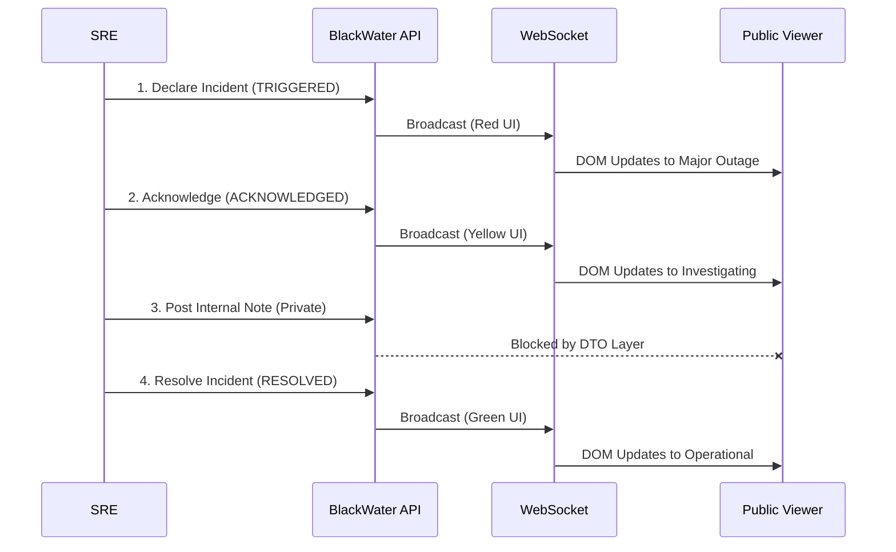

# BlackWater Demo Scenarios

This document outlines realistic, production-grade operational scenarios to demonstrate the capabilities, determinism, and real-time reconciliation of the BlackWater platform.

These scenarios are designed for live interviews, portfolio recordings, or technical deep-dives to prove that the architecture handles multi-channel communication efficiently.

## Prerequisites
1. Ensure the PostgreSQL database is seeded using `npm run seed`.
2. Run the backend and frontend simultaneously (`npm run dev`).
3. Open two browser windows:
    - **Window A (Internal Command Center)**: Authenticated as an Admin at `http://localhost:5173/login`.
    - **Window B (Public Status Page)**: Unauthenticated at `http://localhost:5173/status/<OrgID>`.

---

## Scenario 1: Major Production Outage

**Context**: A severe infrastructure failure has caused the primary API Gateway to collapse, severing all client connections.

*   **Trigger**: Datadog alerts engineering to a massive spike in `502 Bad Gateway` errors.
*   **Timeline**: 0 minutes elapsed.
*   **User Actions (Admin)**:
    1. Navigate to the Incidents dashboard.
    2. Click **Declare Incident**.
    3. Select **API Gateway** from the Service dropdown.
    4. Set Severity to `CRITICAL`.
    5. Enter Title: "Global API Gateway Failure".
    6. Enter Initial Update: "We are investigating a massive spike in 502 errors across the primary API Gateway." (Mark as Public).
*   **Expected System Behaviour**: The backend State Machine creates the incident and instantly recalculates the overall system health. A WebSocket broadcast is emitted.
*   **Status Page Updates**: Within milliseconds, Window B (Public) shifts from a green "All Systems Operational" banner to a red "Major Outage" banner. The API Gateway service row turns red. The incident appears in the Active Incidents feed. No page refresh is required.
*   **Incident Resolution**: Once the ALB rules are corrected, the Admin resolves the incident. The State Machine evaluates the API Gateway, finds no other active incidents, and automatically transitions it back to `OPERATIONAL`.
*   **Postmortem Outcome**: The timeline audit log contains an immutable, chronologically precise record of the declaration, investigation, and resolution phases.

---

## Scenario 2: Database Degradation

**Context**: The primary PostgreSQL cluster is experiencing high CPU load, causing query latency to spike, but the system is technically still functioning.

*   **Trigger**: High latency alerts from the database performance monitor.
*   **Timeline**: 15 minutes into the degradation.
*   **User Actions (Admin)**:
    1. Declare Incident.
    2. Select **Core Database** from the Service dropdown.
    3. Set Severity to `HIGH`.
    4. Enter Title: "Elevated Query Latency".
    5. Post an **Internal Note** (isPublic: false): "Primary DB CPU at 98%. Looking at `pg_stat_statements` to find the rogue query. It might be the new reporting cron job."
*   **Expected System Behaviour**: The DTO (Data Transfer Object) layer intercepts the internal note and strictly prevents it from being serialized into the public API payload.
*   **Status Page Updates**: Window B (Public) shows the system in "Degraded Performance" (yellow). The "Elevated Query Latency" incident is visible, but the engineering note regarding `pg_stat_statements` is completely invisible to the unauthenticated public.
*   **Incident Resolution**: The admin kills the rogue query and resolves the incident.
*   **Postmortem Outcome**: Management can review the incident timeline and clearly see both the public messaging and the private engineering dialogue interleaved in chronological order.

---

## Scenario 3: Third-Party Provider Failure

**Context**: An upstream payment provider (e.g., Stripe) is currently down, preventing checkout flows from completing.

*   **Trigger**: Customers report checkout failures; Stripe status page confirms an outage.
*   **Timeline**: 0 minutes elapsed.
*   **User Actions (Admin)**:
    1. Declare Incident.
    2. Select **Payment Gateway (Third-Party)**.
    3. Set Severity to `HIGH`.
    4. Provide a link to the provider's status page in the update.
*   **Expected System Behaviour**: BlackWater flags the specific service as degraded.
*   **Status Page Updates**: Window B shows a degraded state. Customers attempting to checkout can check the BlackWater page and immediately understand that the issue lies with the upstream provider, deflecting support tickets.
*   **Incident Resolution**: Admin monitors the provider's status page. Once the provider resolves the issue, the Admin resolves the BlackWater incident.
*   **Postmortem Outcome**: The organization has a precise record of how long the third-party outage impacted their business operations, useful for SLA negotiations.

---

## Scenario 4: Regional Service Disruption

**Context**: Only a specific geographic region (e.g., EU-Central) is experiencing connectivity issues due to a localized DNS routing problem.

*   **Trigger**: Synthetic monitoring fails exclusively from EU nodes.
*   **Timeline**: 5 minutes elapsed.
*   **User Actions (Admin)**:
    1. Declare Incident.
    2. Select **EU-Central Edge Nodes**.
    3. Set Severity to `MEDIUM`.
    4. Title: "EU Region Routing Instability".
*   **Expected System Behaviour**: The State Machine calculates a Partial Outage because only a subset of edge nodes are affected, while the core infrastructure remains operational.
*   **Status Page Updates**: Window B updates to a "Partial Outage" (orange) banner. Customers outside the EU can see that their region is unaffected by checking the specific service rows.
*   **Incident Resolution**: DNS records are flushed and propagated. The incident is resolved.
*   **Postmortem Outcome**: The granular service definitions in BlackWater successfully prevented a global panic for a localized issue.

---

## Scenario 5: Full Incident Lifecycle

**Context**: Demonstrating the strict enforcement of the State Machine: `TRIGGERED` -> `ACKNOWLEDGED` -> `RESOLVED`.

*   **Trigger**: An arbitrary service failure.
*   **Timeline**: 0 to 60 minutes.
*   **User Actions (Admin)**: The admin must follow the enforced state transitions. They cannot mark an incident as `CLOSED` without first going through the active phases.
*   **Expected System Behaviour**: The backend strictly rejects invalid state mutations via Zod validation and business logic rules.
*   **Status Page Updates**: The public viewer observes the lifecycle in real-time. They see the exact moment an engineer starts investigating (`ACKNOWLEDGED`), and the exact moment the fix is confirmed (`RESOLVED`), all without ever clicking "Refresh".
*   **Postmortem Outcome**: The strict state machine guarantees that the timeline data is clean, linear, and suitable for automated SLA compliance reporting.
