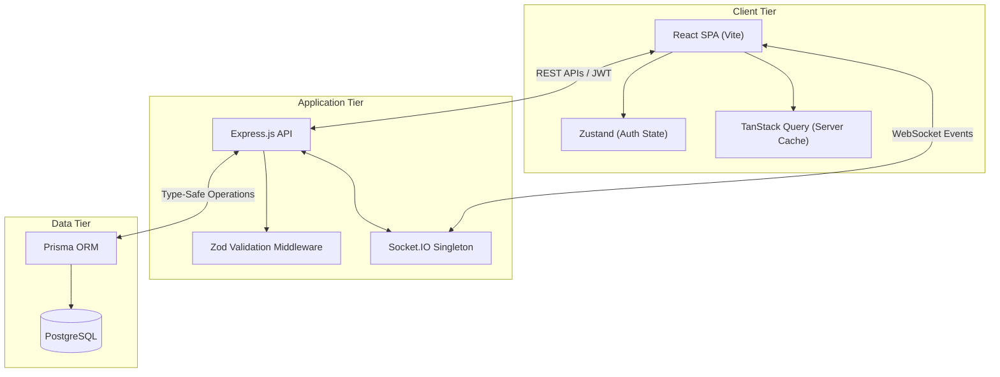

# BlackWater


A deterministic, event-driven, real-time incident management and system status platform.


## Project Overview

BlackWater is a production-grade infrastructure observability and incident management platform designed to eliminate the latency between internal engineering resolution and public customer communication. It binds public status endpoints directly to an internal incident state machine, guaranteeing zero-latency DOM reconciliation and absolute synchronization across decoupled channels.

Built for scale and absolute type-safety, BlackWater leverages a modern Node.js, React, and PostgreSQL stack to provide a robust, multi-tenant environment capable of handling critical infrastructure workflows.

## Key Features

- **Deterministic State Engine**: Algorithmic computation of global infrastructure health based on active incident severity, eliminating manual human-error.
- **Air-Gapped Data Transfer (DTO Layer)**: Strict serialization boundaries guarantee internal engineering notes, UUIDs, and system logs never leak to the unauthenticated public API.
- **Real-Time WebSocket Reconciliation**: Zero-latency DOM updates bypassing client-side HTTP polling through an integrated Socket.IO and TanStack Query architecture.
- **Immutable Audit Timelines**: Transactional audit system natively capturing timeline metadata for every state machine transition.
- **Role-Based Access Control (RBAC)**: Centralized, stateless JWT middleware enforcing Admin, Member, and Viewer privileges in O(1) time.
- **Multi-Tenant Architecture**: Top-level tenant isolation supporting multiple organizations within a single deployment.

## System Capabilities

BlackWater provides an integrated platform spanning two major domains:

1. **Internal Command Center**: A secure, authenticated dashboard for engineering and SRE teams to declare incidents, post internal updates, and resolve outages.
2. **Public Status Page**: A highly available, read-only portal for end-users to view current system health and historical incident reports without needing to authenticate.


## Architecture Highlights

The architecture is built around event-driven paradigms and strict boundary enforcement. The backend does not simply serve data; it operates as an intelligent State Machine. When a database transaction commits an incident state change, the server immediately emits a typed WebSocket event. The frontend intercepts this socket event and programmatically invalidates its TanStack Query caches, forcing a local DOM re-render without relying on inefficient REST polling.

## Tech Stack

**Frontend:**
- React 18 (Vite)
- TypeScript (Strict Mode)
- Tailwind CSS (Radix-inspired primitives)
- Zustand (Client State)
- TanStack React Query (Server State)

**Backend:**
- Node.js & Express
- TypeScript
- Prisma ORM
- PostgreSQL (JSONB for audit logs)
- Socket.IO
- Zod (Runtime Type Validation)

## Documentation Structure

For a complete technical deep-dive, please refer to the following documents:
- [Architecture Deep Dive](ARCHITECTURE.md) - System goals, DTO boundaries, and scalability design.
- [Demo Scenarios](DEMO_SCENARIOS.md) - Realistic operational scenarios for evaluating the platform.
- [Testing Strategy](TESTING.md) - Overview of Unit, Integration, and E2E testing strategies.
- [Deployment Guide](DEPLOYMENT.md) - Docker, CI/CD, and production readiness instructions.
- [API Documentation](API_DOCS.md) - REST API examples for programmatic integrations.

## System Architecture



## Local Development Setup

```bash
# 1. Clone & Install
git clone https://github.com/Ayush-o1/BlackWater.git
cd BlackWater
npm install

# 2. Database Setup
cp .env.example .env
# Ensure PostgreSQL is running locally and DATABASE_URL is configured in .env
npx prisma migrate dev
npm run seed

# 3. Start the Backend API (Port 8000)
npm run dev

# 4. Start the Frontend Application (Port 5173)
cd frontend
npm install
npm run dev
```

## Future Roadmap

- **Infrastructure as Code (IaC)**: Terraform configurations for automated, repeatable AWS deployments.
- **Kubernetes Orchestration**: Helm charts to manage deployment lifecycles, liveness/readiness probes, and horizontal pod autoscaling.
- **Distributed Caching**: Redis integration for aggressive caching of unauthenticated public status endpoints.
- **Webhook Integrations**: Native integrations with PagerDuty, Datadog, and Slack.

## License

MIT License. See `LICENSE` for more information.

## Contributors

Built by the engineering team behind BlackWater.
