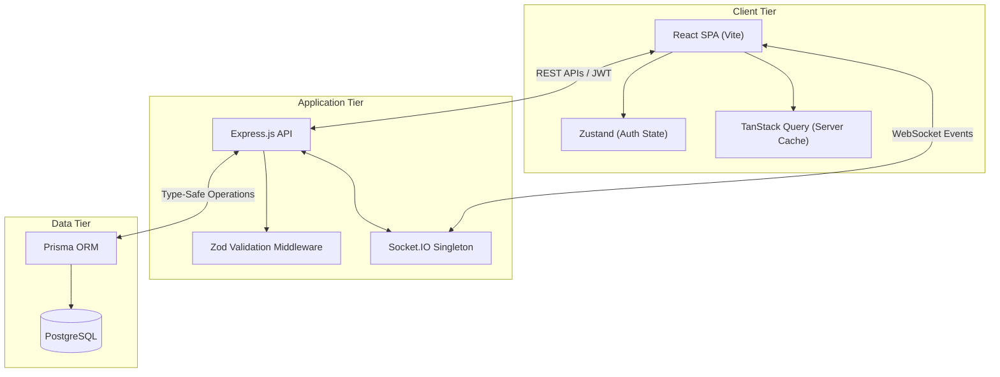
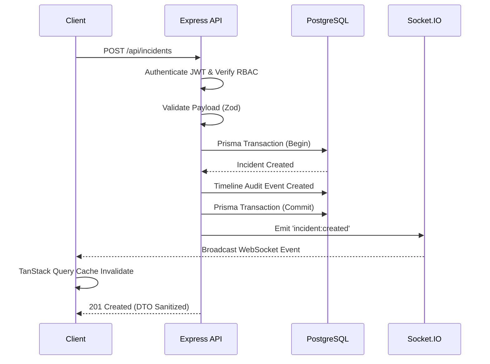

# BlackWater

A deterministic, event-driven, real-time incident management and system status platform.

## Project Overview

BlackWater is a production-grade infrastructure observability and incident management platform designed to eliminate the latency between internal engineering resolution and public customer communication. It binds public status endpoints directly to an internal incident state machine, guaranteeing zero-latency DOM reconciliation and absolute synchronization across decoupled channels.

Built for scale and absolute type-safety, BlackWater leverages a modern Node.js, React, and PostgreSQL stack to provide a robust, multi-tenant environment capable of handling critical infrastructure workflows.

## Key Features

- **Deterministic State Engine**: Algorithmic computation of global infrastructure health based on active incident severity, eliminating manual human-error.
- **Air-Gapped Data Transfer (DTO Layer)**: Strict serialization boundaries guarantee internal engineering notes, UUIDs, and system logs never leak to the unauthenticated public API.
- **Real-Time WebSocket Reconciliation**: Zero-latency DOM updates bypassing client-side HTTP polling through an integrated Socket.IO and TanStack Query architecture.
- **Immutable Audit Timelines**: Transactional audit system natively capturing timeline metadata for every state machine transition.
- **Role-Based Access Control (RBAC)**: Centralized, stateless JWT middleware enforcing Admin, Member, and Viewer privileges in O(1) time.
- **Multi-Tenant Architecture**: Top-level tenant isolation supporting multiple organizations within a single deployment.

## System Capabilities

BlackWater provides an integrated platform spanning two major domains:
1. **Internal Command Center**: A secure, authenticated dashboard for engineering and SRE teams to declare incidents, post internal updates, and resolve outages.
2. **Public Status Page**: A highly available, read-only portal for end-users to view current system health and historical incident reports without needing to authenticate.

## Architecture Highlights

The architecture is built around event-driven paradigms and strict boundary enforcement. The backend does not simply serve data; it operates as an intelligent State Machine. When a database transaction commits an incident state change, the server immediately emits a typed WebSocket event. The frontend intercepts this socket event and programmatically invalidates its TanStack Query caches, forcing a local DOM re-render without relying on inefficient REST polling.

## Tech Stack

**Frontend:**
- React 18 (Vite)
- TypeScript (Strict Mode)
- Tailwind CSS (Radix-inspired primitives)
- Zustand (Client State)
- TanStack React Query (Server State)

**Backend:**
- Node.js & Express
- TypeScript
- Prisma ORM
- PostgreSQL (JSONB for audit logs)
- Socket.IO
- Zod (Runtime Type Validation)

## Why This Project Exists

Internal engineering teams frequently experience a disconnect between resolving backend system outages and updating customer-facing status pages. Manual synchronization across decoupled communication channels introduces significant latency and human error, leaving public status dashboards inaccurate while engineers focus on resolving critical infrastructure issues.

BlackWater bridges this gap. By operating as a unified State Machine, an engineer resolving an internal alert natively triggers an automatic, secure WebSocket broadcast that updates the public-facing status page instantly—without manual intervention.

## System Architecture



## Request Lifecycle



## Database Overview

The data model is structured via the Prisma ORM to guarantee absolute type safety across the full stack. PostgreSQL was deliberately chosen for its ACID compliance and robust native support for `JSONB` columns, which are critical for storing dynamic, unstructured metadata payloads within the immutable `TimelineEvent` audit logs.

### Core Entities
*   **Organization**: Top-level multi-tenant container enforcing data isolation.
*   **User**: Managed via Role-Based Access Control (Admin, Member, Viewer).
*   **Service**: Represents underlying infrastructure layers and external dependencies.
*   **Incident**: The core event entity driving the state machine.
*   **TimelineEvent**: Immutable chronological audit log storing JSON metadata of state changes.

## Deployment Architecture

Currently designed for containerized deployment, BlackWater utilizes Docker to package the Node.js API and React frontend into immutable artifacts. In a production environment, the frontend is distributed via CDN, while the backend API scales horizontally behind a reverse proxy (e.g., Nginx, ALB) utilizing a Redis adapter for Socket.IO state synchronization.

## Engineering Tradeoffs

*   **Prisma vs. Query Builder**: Prisma was chosen over lightweight query builders (like Kysely) or raw SQL to maximize developer velocity and guarantee end-to-end type safety bridging the DB to the React props. The tradeoff is a heavier ORM footprint and less control over highly complex aggregate queries, which is mitigated by raw query fallbacks where necessary.
*   **WebSockets vs. Server-Sent Events (SSE)**: Socket.IO was selected over native SSE to provide bi-directional capabilities for future interactive features (e.g., real-time engineering chat within incidents), despite SSE being slightly lighter for uni-directional state broadcasts.
*   **Zustand vs. Redux**: Zustand was selected for its minimal boilerplate and unopinionated nature. Given TanStack Query handles 90% of the complex asynchronous server state, Redux would have introduced unnecessary complexity for the remaining 10% of synchronous client state (e.g., JWT identity, UI themes).

## Local Development Setup

```bash
# 1. Clone & Install
git clone https://github.com/Ayush-o1/BlackWater.git
cd BlackWater
npm install

# 2. Database Setup
cp .env.example .env
# Ensure PostgreSQL is running locally and DATABASE_URL is configured in .env
npx prisma migrate dev
npm run seed

# 3. Start the Backend API (Port 8000)
npm run dev

# 4. Start the Frontend Application (Port 5173)
cd frontend
npm install
npm run dev
```

## Future Roadmap

- **Infrastructure as Code (IaC)**: Terraform configurations for automated, repeatable AWS deployments.
- **Kubernetes Orchestration**: Helm charts to manage deployment lifecycles, liveness/readiness probes, and horizontal pod autoscaling.
- **Distributed Caching**: Redis integration for aggressive caching of unauthenticated public status endpoints to withstand massive traffic spikes during severe outages.
- **Webhook Integrations**: Native integrations with PagerDuty, Datadog, and Slack for automated incident triggering.

## License

MIT License. See `LICENSE` for more information.

## Contributors

Built by the engineering team behind BlackWater.
