# 🌊 BlackWater
### Real-Time Infrastructure Incident Management


**BlackWater** is a production-grade infrastructure observability and incident management platform designed to eliminate the latency between internal engineering resolution and public customer communication. It binds public status endpoints directly to an internal incident state machine, guaranteeing zero-latency DOM reconciliation and absolute synchronization across decoupled channels.

---

## 🏗️ Architecture & Engineering Highlights

- **Deterministic State Engine**: Algorithmic computation of global infrastructure health based on active incident severity, eliminating manual human-error.
- **Air-Gapped Data Transfer (DTO Layer)**: Strict serialization boundaries guarantee internal engineering notes, UUIDs, and system logs never leak to the unauthenticated public API.
- **Real-Time WebSocket Reconciliation**: Zero-latency DOM updates bypassing client-side HTTP polling through an integrated Socket.IO and TanStack Query architecture.
- **Immutable Audit Timelines**: Transactional audit system natively capturing timeline metadata for every state machine transition.
- **Role-Based Access Control (RBAC)**: Centralized, stateless JWT middleware enforcing Admin, Member, and Viewer privileges in O(1) time.
- **Multi-Tenant Architecture**: Top-level tenant isolation supporting multiple organizations within a single deployment.

---

## 📸 Platform Showcase

### Public Status Page
The highly available, read-only portal for end-users. It reflects the live state of the infrastructure in real-time, driven directly by backend WebSocket events.

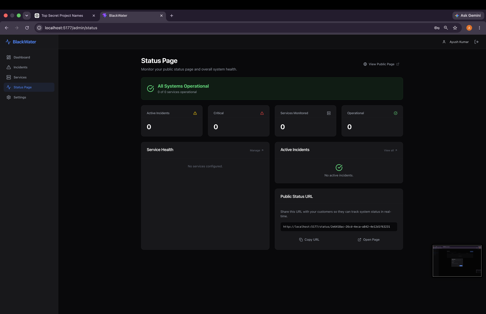
<br/>
*A healthy public status page reflecting normal operational status across all infrastructure components.*

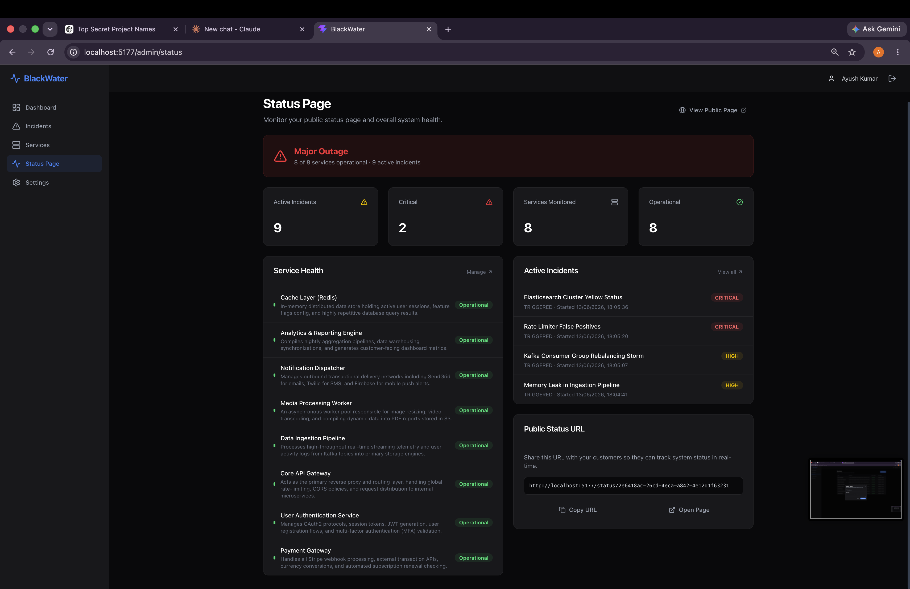
<br/>
*Public status page automatically updated to reflect a major outage based on active critical incidents.*

### Internal Command Center: Dashboard
A secure, authenticated dashboard for engineering and SRE teams to monitor platform health and active incidents.

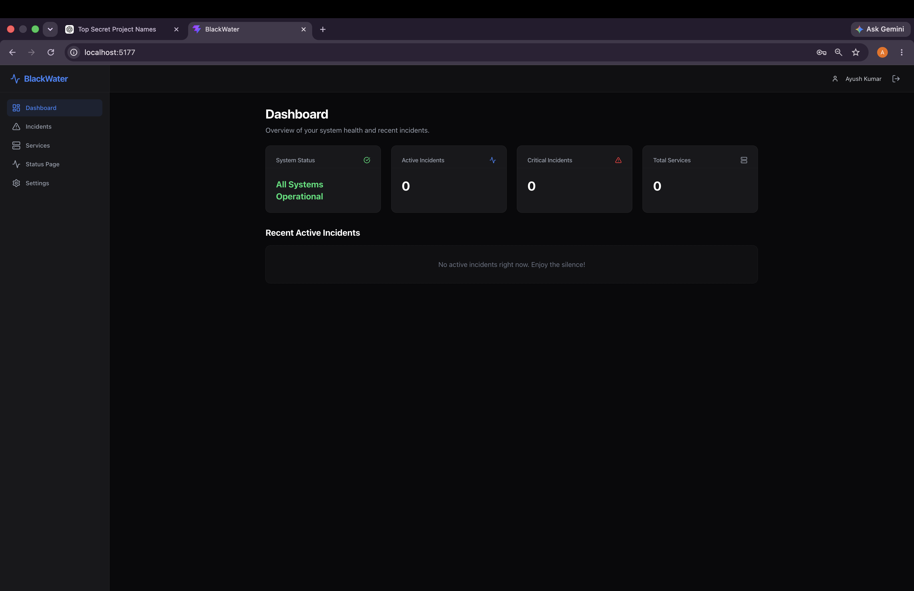
<br/>
*The primary operational dashboard providing a high-level overview of system status and active incident count.*

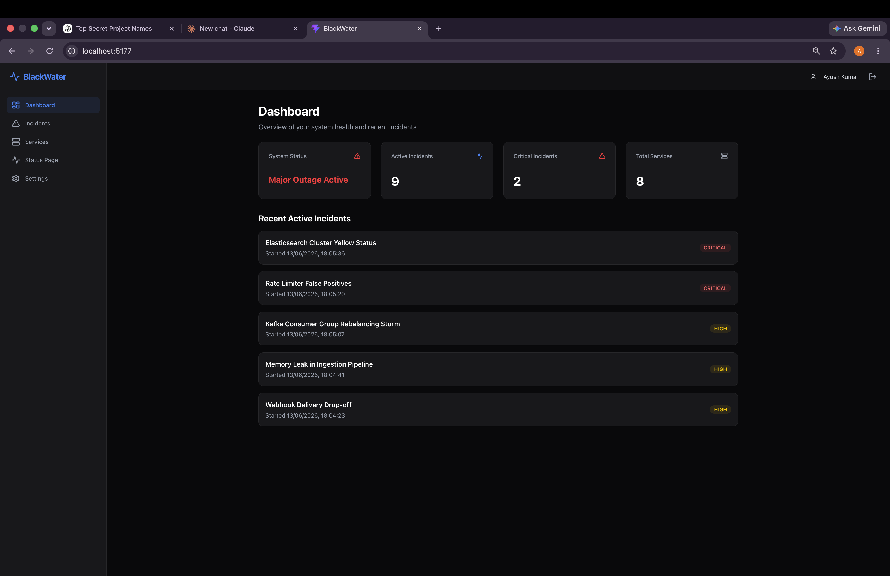
<br/>
*Dashboard reflecting real-time updates as multiple high-severity incidents are declared.*

### Incident Management
Comprehensive incident lifecycle tracking with immutable audit trails.

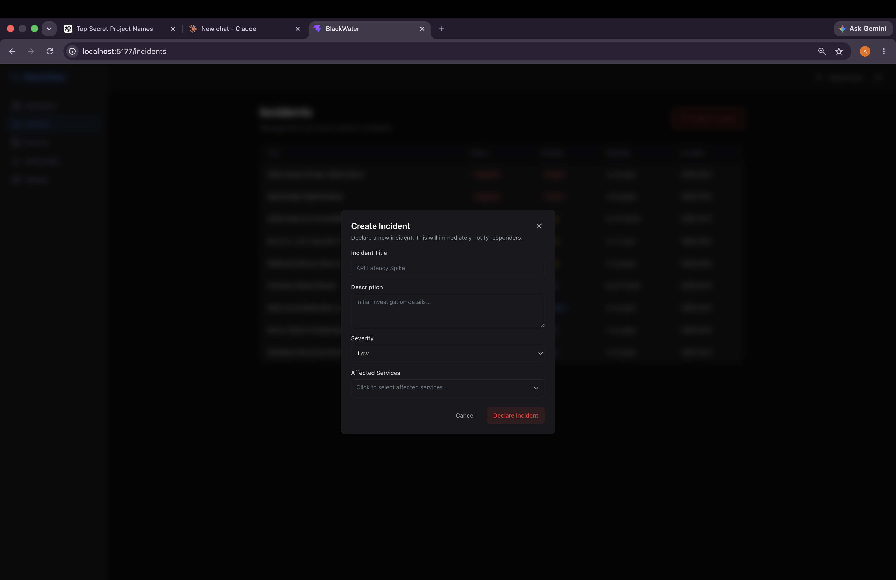
<br/>
*A centralized view of all active and resolved incidents with severity, impact, and status.*

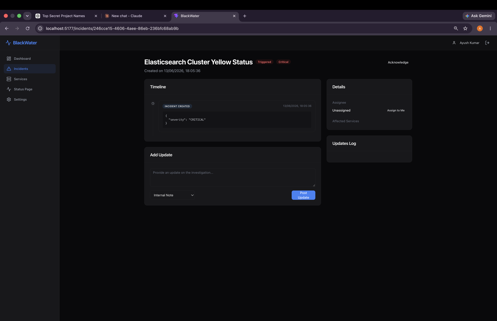
<br/>
*Detailed incident view allowing engineering teams to post internal updates and transition incident states.*

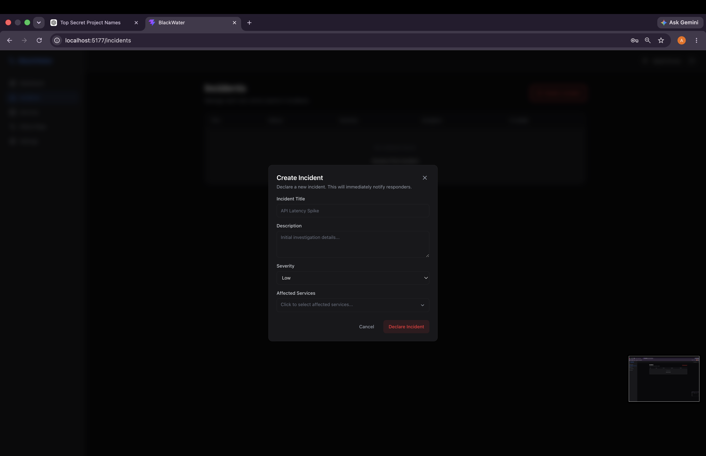
<br/>
*The incident creation flow capturing essential data, severity, and impacted services.*

### Service Registry
A central repository of all tracked microservices and infrastructure components.

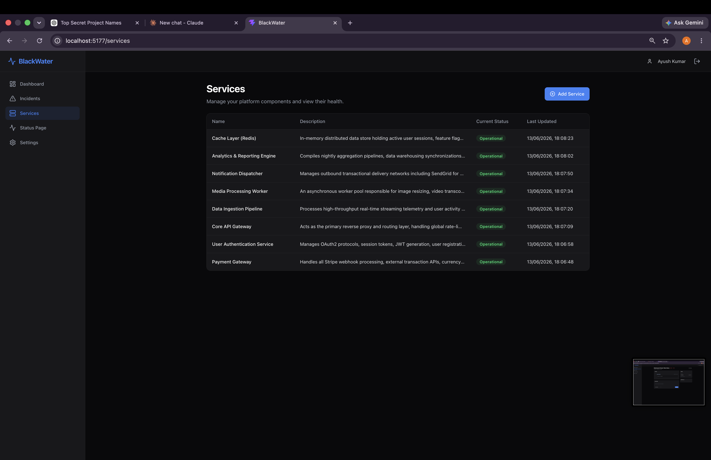
<br/>
*A managed list of services detailing their descriptions, current operational status, and last update times.*

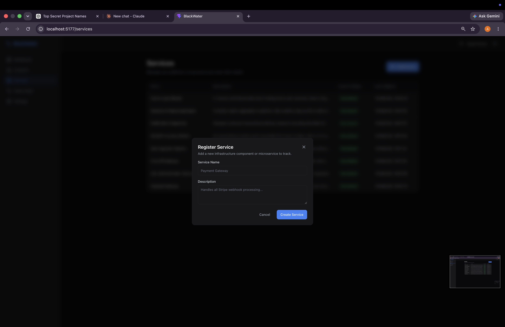
<br/>
*Adding a new microservice to the tracking registry with descriptions and initial state.*

### Platform Administration
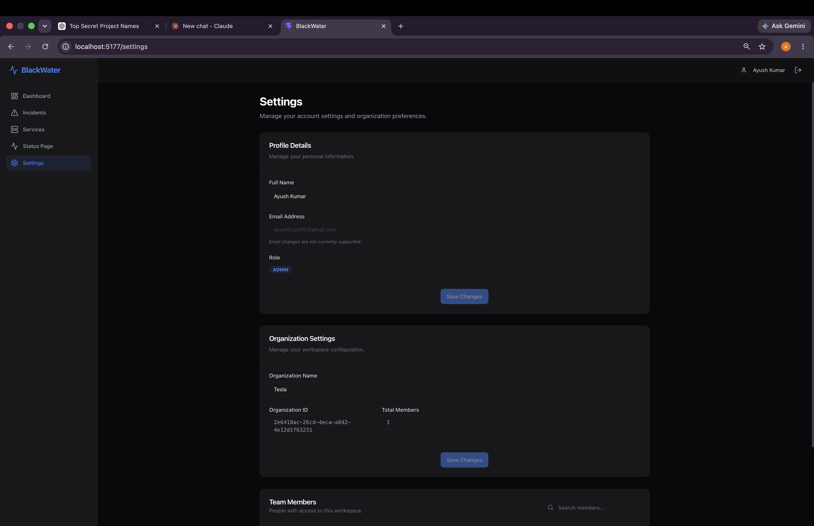
<br/>
*Workspace and platform configuration, managing user roles, access control, and organization details.*

---

## 🛠️ Tech Stack

**Frontend:**
- React 18 (Vite)
- TypeScript (Strict Mode)
- Tailwind CSS
- Zustand (Client State)
- TanStack React Query (Server State)

**Backend:**
- Node.js & Express
- TypeScript
- Prisma ORM
- PostgreSQL (JSONB for audit logs)
- Socket.IO
- Zod (Runtime Type Validation)

---

## 🗺️ System Architecture

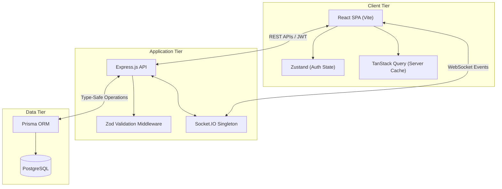

---

## 🚀 Local Development Setup

```bash
# 1. Clone & Install
git clone https://github.com/Ayush-o1/BlackWater.git
cd BlackWater
npm install

# 2. Database Setup
cp .env.example .env
# Ensure PostgreSQL is running locally and DATABASE_URL is configured in .env
npx prisma migrate dev
npm run seed

# 3. Start the Backend API (Port 8000)
npm run dev

# 4. Start the Frontend Application (Port 5173)
cd frontend
npm install
npm run dev
```

---

## 📚 Documentation

For a complete technical deep-dive, please refer to the following documents:
- [Architecture Deep Dive](ARCHITECTURE.md) - System goals, DTO boundaries, and scalability design.
- [Demo Scenarios](DEMO_SCENARIOS.md) - Realistic operational scenarios for evaluating the platform.
- [Testing Strategy](TESTING.md) - Overview of Unit, Integration, and E2E testing strategies.
- [API Documentation](API_DOCS.md) - REST API examples for programmatic integrations.

---

## 🔮 Future Roadmap

- **Infrastructure as Code (IaC)**: Terraform configurations for automated, repeatable AWS deployments.
- **Kubernetes Orchestration**: Helm charts to manage deployment lifecycles, liveness/readiness probes, and horizontal pod autoscaling.
- **Distributed Caching**: Redis integration for aggressive caching of unauthenticated public status endpoints.
- **Webhook Integrations**: Native integrations with PagerDuty, Datadog, and Slack.

---

## 📄 License
MIT License. See `LICENSE` for more information.
