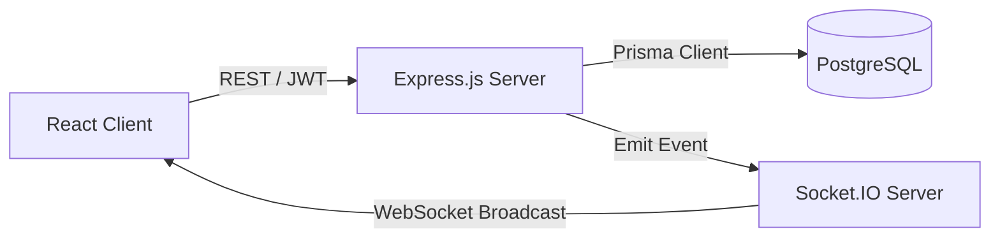
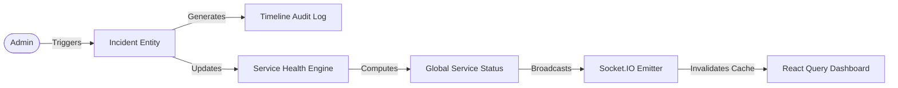
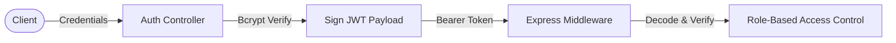
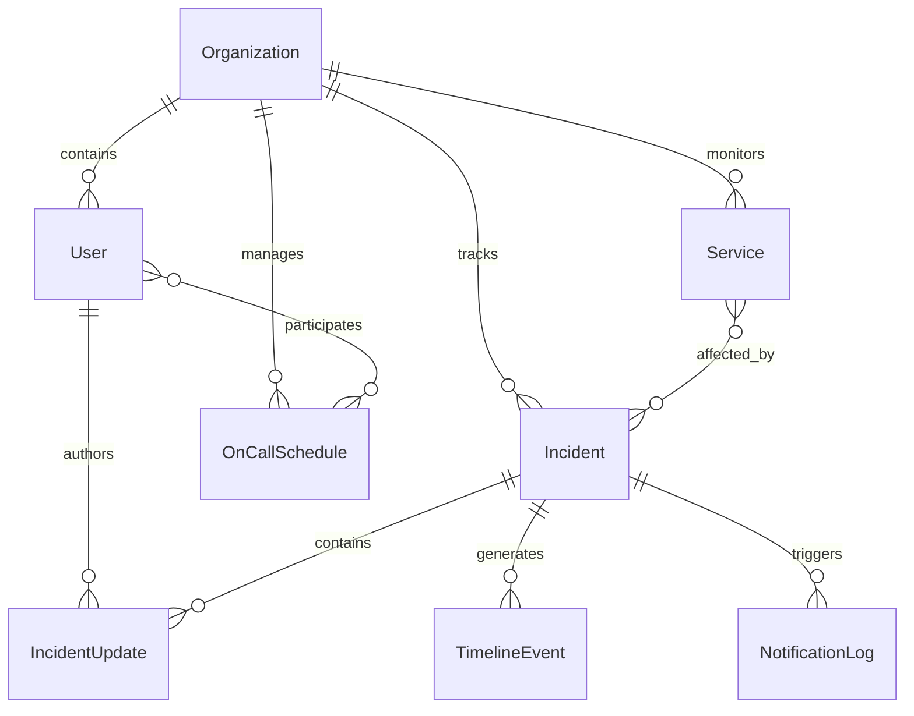

# SignalOps

A deterministic, event-driven real-time incident management and system status platform.

## Problem Statement

Internal engineering teams frequently experience a disconnect between resolving backend system outages and updating customer-facing status pages. Manual synchronization across decoupled communication channels introduces significant latency and human error, leaving public status dashboards inaccurate while engineers focus on resolving critical infrastructure issues.

## Solution

SignalOps solves this operational gap by binding public status endpoints directly to the internal incident state machine. It eliminates manual status toggles by utilizing a deterministic service engine that computes infrastructure health natively. By utilizing an event-driven WebSocket architecture and strict DTO boundaries, SignalOps updates both internal and unauthenticated clients in real-time, completely air-gapping sensitive operational metadata from the public domain.

## Core Features

* **Incident Management**: End-to-end operational lifecycle management with strict state mutation rules.
* **Service Health Engine**: Algorithmic computation of global infrastructure health based on active incident severity.
* **Real-Time Updates**: Zero-latency DOM reconciliation bypassing client-side HTTP polling.
* **Authentication & RBAC**: Centralized, stateless JWT middleware enforcing Admin, Member, and Viewer roles in O(1) time.
* **Public Status Pages**: Secure, unauthenticated read-only views stripped of internal engineering logs.
* **Timeline Auditing**: Transactional audit system natively capturing timeline metadata for every state transition.
* **Multi-Tenant Organizations**: Top-level tenant isolation supporting multiple organizations within a single deployment.

## System Architecture

### High-Level Architecture



### Incident Flow



### Authentication Flow



## Database Design

The data model is structured via the Prisma ORM to guarantee absolute type safety across the full stack.



### Key Entities

* **Organization**: Top-level multi-tenant container enforcing data isolation.
* **User**: Managed via Role-Based Access Control (Admin, Member, Viewer).
* **Service**: Represents underlying infrastructure layers and external dependencies.
* **Incident**: The core event entity driving the state machine.
* **IncidentUpdate**: Relational communication threads constrained by strict `isPublic` privacy flags.
* **TimelineEvent**: Immutable chronological audit log storing JSON metadata of state changes.
* **NotificationLog**: Historical ledger of outbound webhook and email alerts.
* **OnCallSchedule**: Rotational schedules mapping engineers to specific escalation paths.

## Technology Stack

**Frontend:**
* React
* TypeScript
* Zustand
* React Query
* Tailwind

**Backend:**
* Node.js
* Express
* Prisma
* PostgreSQL
* Socket.IO

**Infrastructure:**
* Docker
* PostgreSQL

## Engineering Achievements

* Architected and delivered across **11 implementation phases**.
* Designed **10+ normalized database models** utilizing Prisma schema generation.
* Engineered **20+ secured API endpoints** with strict request/response validation.
* Implemented a zero-latency **WebSocket event architecture** for seamless client updates.
* Centralized **Role-based authorization** utilizing stateless JWT session management.
* Ensured a completely **Type-safe full stack architecture** bridging PostgreSQL schemas directly to React props.
* Leveraged **Atomic Prisma transactions** to guarantee data integrity during multi-table mutations.
* Eliminated manual REST polling by establishing **Real-time synchronization** across public and private dashboards.

## Design Decisions

* **Why Prisma**: Provides end-to-end type safety from the database schema to the React frontend. It enables an incredibly tight developer feedback loop where schema changes instantly trigger TypeScript compilation errors across the stack if API fetchers are not updated.
* **Why PostgreSQL**: Selected for its ACID compliance, robust relational integrity, and native support for JSONB columns, which is strictly required for storing the dynamic metadata payloads within the TimelineEvent audit logs.
* **Why Socket.IO**: Deliberately chosen over Backend-as-a-Service (BaaS) alternatives to maintain full architectural control over the WebSocket infrastructure, enabling precise event mapping and socket-level RBAC enforcement.
* **Why Zustand**: Selected over Redux for its minimal boilerplate and unopinionated nature, providing an efficient slice-based approach to managing global client state like JWT identities and UI toggles.
* **Why React Query**: Resolves complex server-state challenges natively. By intercepting WebSocket broadcasts and invalidating specific React Query keys, the frontend automatically triggers targeted DOM reconciliations without unnecessary HTTP refetches.

## Local Development

```bash
# 1. Clone & Install
git clone https://github.com/Ayush-o1/statusDec.git
cd statusDec
npm install

# 2. Database Setup
cp .env.example .env
# Ensure PostgreSQL is running and DATABASE_URL is set in .env
npx prisma migrate dev
npm run seed

# 3. Start the Node.js API (Port 3000)
npm run dev

# 4. Start the Vite React Client (Port 5173)
cd frontend
npm install
npm run dev
```

## Future Improvements

* **Infrastructure as Code (IaC)**: Terraform configurations for automated AWS deployments.
* **Kubernetes Orchestration**: Helm charts to manage the deployment of the Node.js API, PostgreSQL instances, and Redis (for Socket.IO adapter scaling).
* **CI/CD Pipeline**: GitHub Actions for automated testing, Docker image building, and continuous deployment.
* **Horizontal Scaling**: Implementing a Redis adapter for Socket.IO to support multi-node backend clusters behind a load balancer.
